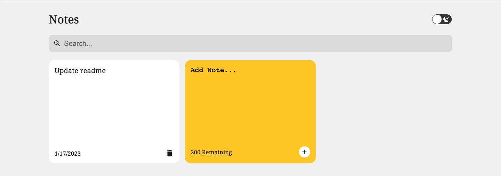
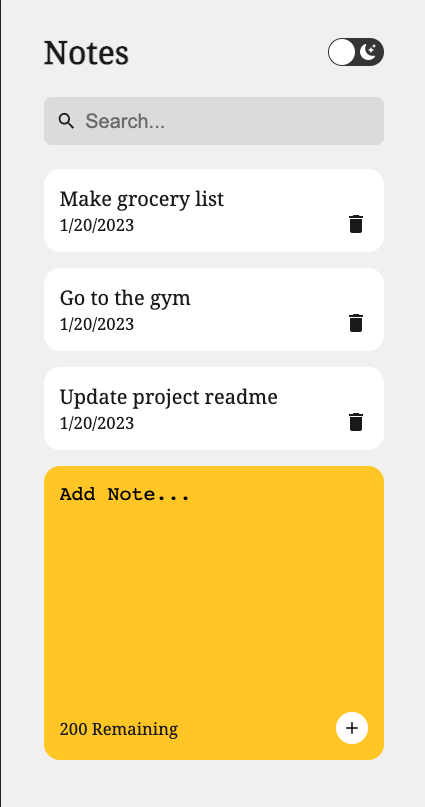
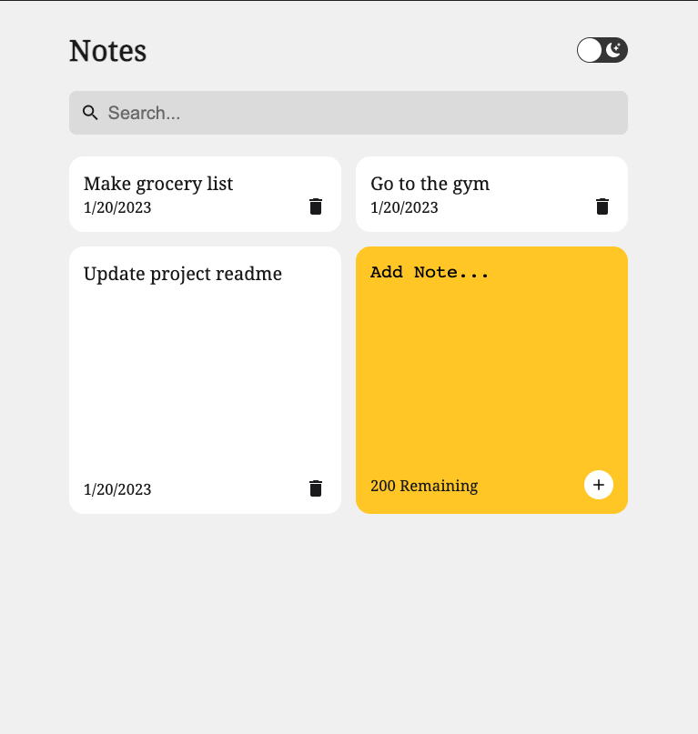
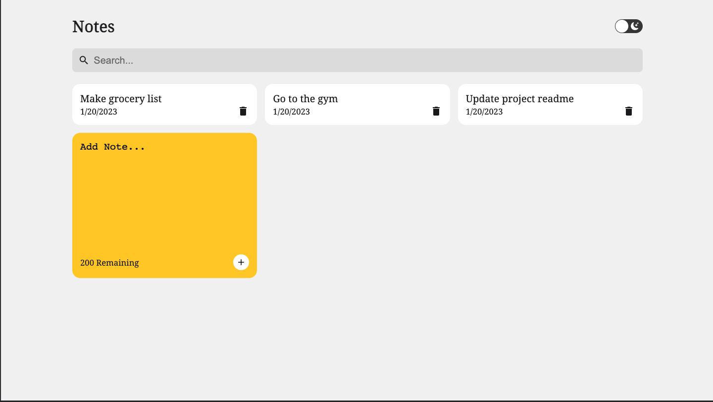

<p align="center">
    
</p>

[Preview](https://klam2k20.github.io/Notes/)

## Overview

This is a responsive Notes App created with ReactJS. The app has the fundamental functionalities to create and delete tasks.
It utilizes React's internal useState to handle app state and local storage to track notes in between sessions.

The application was designed to be responsive for various device sizes as seen below: <br> <br>
 &nbsp; &nbsp; &nbsp; &nbsp; &nbsp; &nbsp; &nbsp;



## Getting Started

### Prerequisites

- yarn
  ```sh
  npm install -g yarn
  ```

### Installation

1. Clone the repo
   ```sh
   git clone https://github.com/klam2k20/Notes.git
   ```
2. `cd` to project folder
3. Install yarn packages
   ```sh
   yarn install
   ```
4. Start React project
   ```sh
   yarn start
   ```
