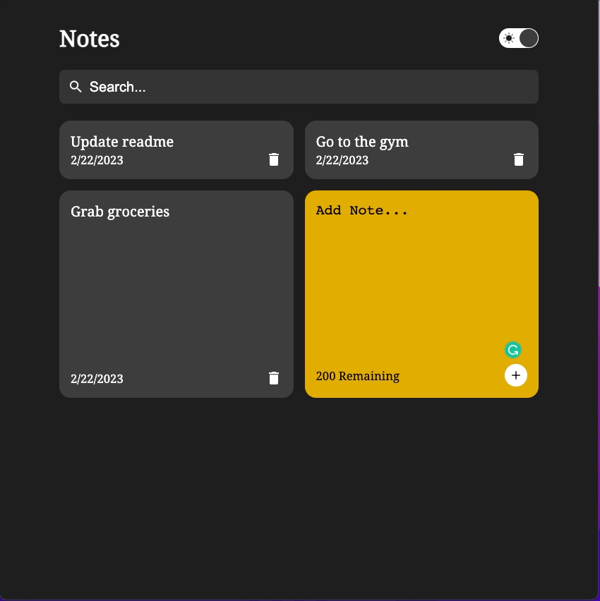
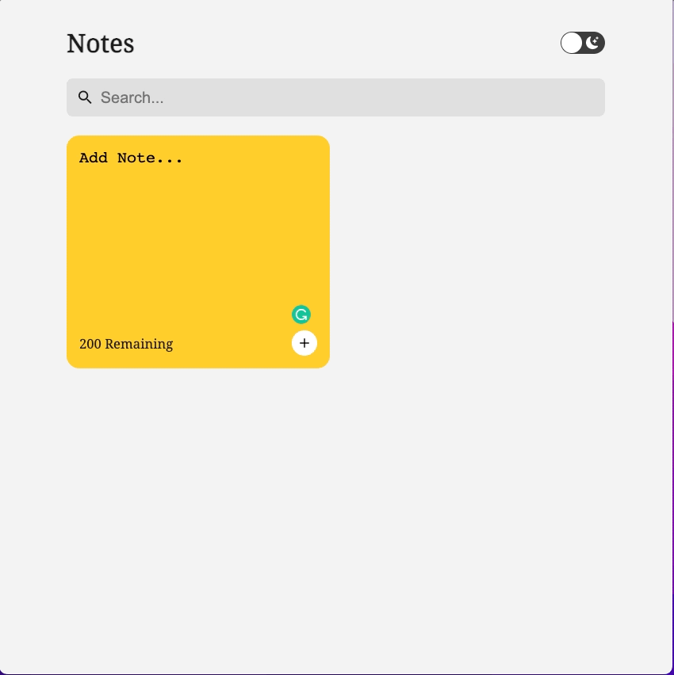
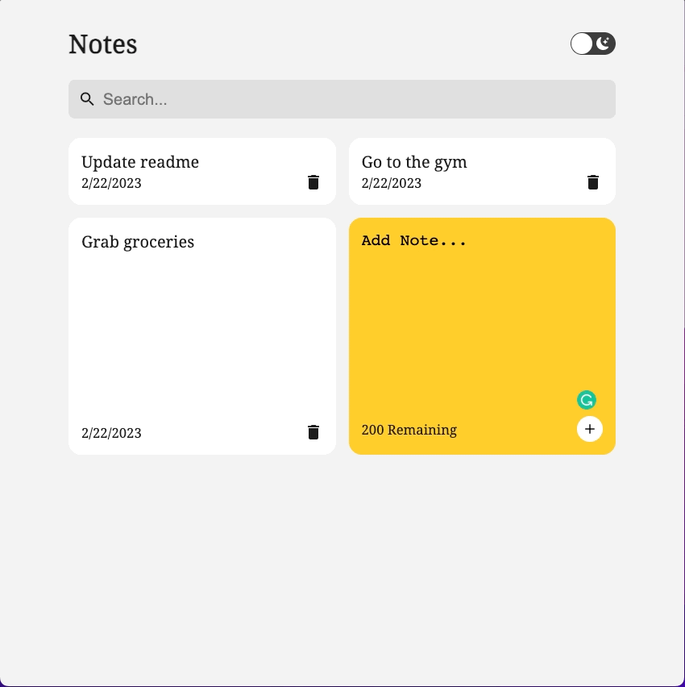
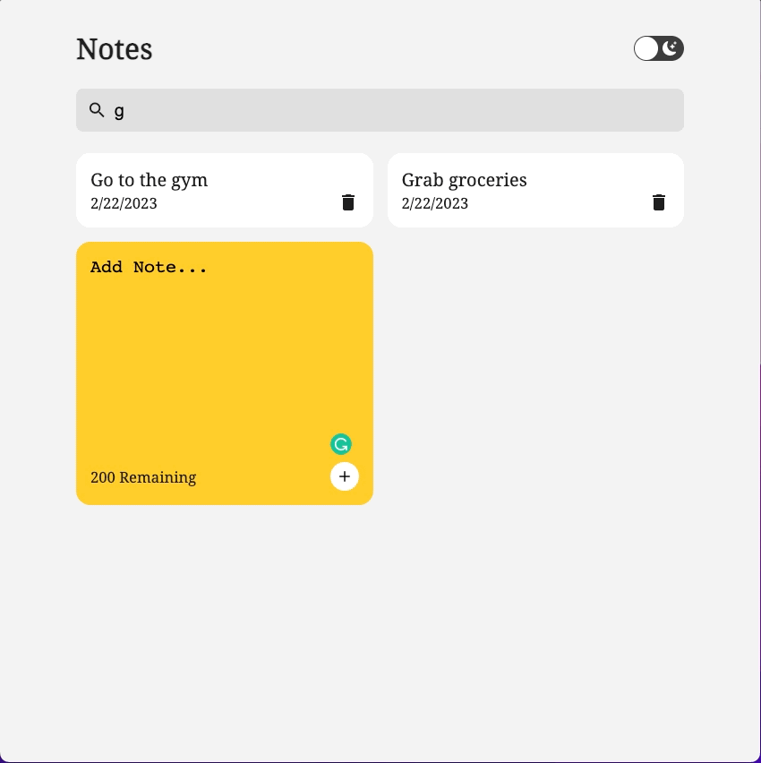

<p align="center">
    
</p>

[Preview](https://klam2k20.github.io/Notes/)

## Overview

This is a responsive Notes App. It has the fundamental functionalities to create and delete tasks.
It utilizes React's internal useState to handle app state and local storage to track notes in between sessions.

## Technology

- 
- 

## Features

- Responsive Design
<p align="center">
    
</p>

- Add Tasks
<p align="center">
    
</p>

- Delete Tasks
<p align="center">
    
</p>

- Filter Tasks
<p align="center">
    
</p>

- Dark Mode
<p align="center">
    
</p>

## Getting Started

### Prerequisites

- yarn/npm

### Installation

```sh
# Clone the repo
git clone https://github.com/klam2k20/Notes.git

# cd to project folder
cd Notes

# Install dependencies
yarn install

# Start the application
yarn start
```
